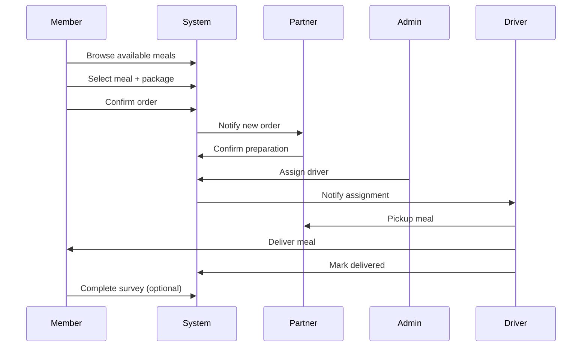
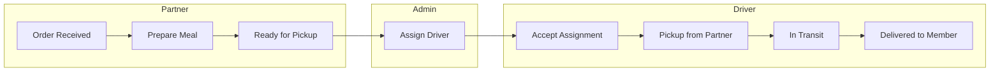
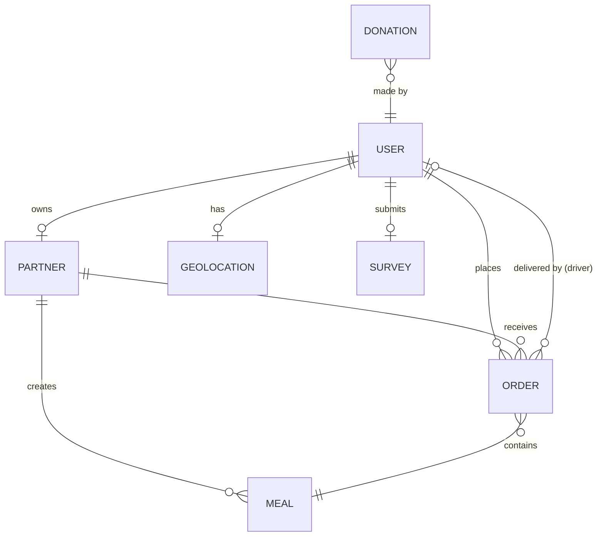

# Merry Meals - Business Flow Documentation

## Overview

Merry Meals adalah platform Meals on Wheels yang menghubungkan member (lansia/penyandang disabilitas) dengan partner restoran dan driver volunteer untuk pengiriman makanan bernutrisi.

---

## Platform Roles

| Role            | Description        | Primary Functions            |
| --------------- | ------------------ | ---------------------------- |
| **Super Admin** | Platform owner     | Full system access, settings |
| **Admin**       | Operations manager | User & donation management   |
| **Member**      | Meal recipient     | Browse, order, track meals   |
| **Driver**      | Volunteer delivery | Pickup & deliver orders      |
| **Partner**     | Restaurant owner   | Manage meals & availability  |

---

## Core Business Flows

### 1. Member Order Flow

### 2. Partner-Driver Delivery Flow

### 3. Order Status Lifecycle

| Status        | Actor   | Action              | Next Status   |
| ------------- | ------- | ------------------- | ------------- |
| `pending`     | Member  | Places order        | `preparation` |
| `preparation` | Partner | Confirms & prepares | `assigned`    |
| `assigned`    | Admin   | Assigns driver      | `picked_up`   |
| `picked_up`   | Driver  | Picks up meal       | `in_transit`  |
| `in_transit`  | Driver  | En route            | `delivered`   |
| `delivered`   | Driver  | Completes delivery  | (End)         |

---

## Role-Specific Features

### Super Admin Features

1. **User Management** - CRUD all users across roles
2. **Partner Management** - Approve/reject partner applications
3. **Member Management** - Oversee member accounts
4. **Driver Management** - Manage volunteer drivers
5. **Platform Settings** - System configuration
6. **Donation Management** - Track & manage donations
7. **Report Analysis** - Comprehensive analytics

### Admin Features

1. **User Management** - Manage members & drivers
2. **Donation Management** - View donation history
3. **Report Analysis** - Operational reports

### Member Features

1. **Order History** - View past orders with status
2. **Browse Meals** - View available meals from partners
3. **Meal Details** - Ingredients, nutrition, images
4. **Geolocation** - Delivery address management
5. **Nutrition Tracking** - Track dietary intake
6. **Survey Feedback** - Rate delivery experience

### Driver Features

1. **Order Dashboard** - View assigned deliveries
2. **Order Tracking** - Real-time status updates
3. **Availability Toggle** - Set online/offline status
4. **Pickup/Delivery Actions** - Mark order progress
5. **Delivery History** - Past deliveries

### Partner Features

1. **Meal Management** - Create, edit, delete meals
2. **Availability Control** - Toggle meal availability
3. **Order Management** - View incoming orders
4. **Recipe Management** - Ingredients & descriptions
5. **Kitchen Status** - Open/Closed indicator

---

## Data Model Relationships

---

## Access Control Matrix

| Resource  | Super Admin |   Admin    |  Member  |  Driver  | Partner  |
| --------- | :---------: | :--------: | :------: | :------: | :------: |
| All Users |   ✅ CRUD   |  ✅ Read   |    ❌    |    ❌    |    ❌    |
| Partners  |   ✅ CRUD   |  ✅ Read   |    ❌    |    ❌    | Own only |
| Members   |   ✅ CRUD   |  ✅ CRUD   | Own only |    ❌    |    ❌    |
| Drivers   |   ✅ CRUD   |  ✅ CRUD   |    ❌    | Own only |    ❌    |
| Meals     |   ✅ CRUD   |  ✅ Read   | ✅ Read  |    ❌    | Own CRUD |
| Orders    |   ✅ CRUD   |  ✅ CRUD   | Own only | Assigned | Own only |
| Donations |   ✅ CRUD   |  ✅ Read   |    ❌    |    ❌    |    ❌    |
| Reports   |   ✅ Full   | ✅ Limited |    ❌    |    ❌    | Own only |
| Settings  |   ✅ Full   |     ❌     |    ❌    |    ❌    |    ❌    |

---

## Integration Points

### Geolocation

- Member address for delivery
- Distance calculation for routing
- Partner location for pickup

### Payment (Stripe)

- Donation processing
- Secure payment handling
- Transaction history

### Notifications (Future)

- Order status updates
- Driver assignment alerts
- Delivery confirmations
