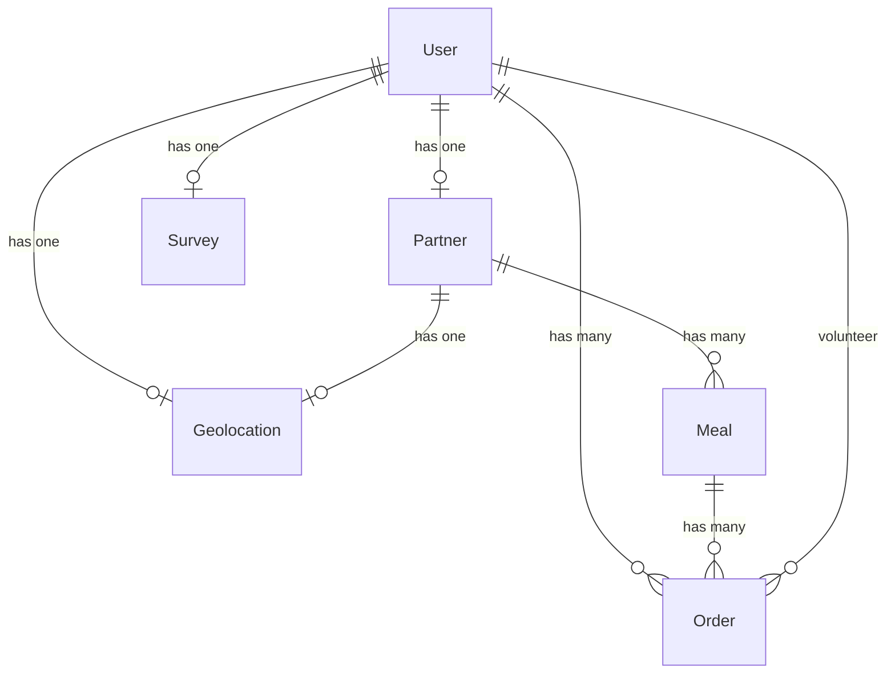

# Database Schema

## Entity Relationship Diagram



## Models

### User

| Column   | Type   | Description                |
| -------- | ------ | -------------------------- |
| id       | bigint | Primary key                |
| fullname | string | Full name                  |
| username | string | Username                   |
| email    | string | Email address              |
| phone    | string | Phone number               |
| password | string | Hashed password            |
| role     | string | admin/member/partner/rider |

**Relationships:**

- `hasOne(Partner)` - Restaurant partner profile
- `hasMany(Order)` - Meal orders
- `hasOne(Geolocation)` - Location data
- `hasOne(Survey)` - Feedback survey

---

### Partner

| Column            | Type   | Description      |
| ----------------- | ------ | ---------------- |
| id                | bigint | Primary key      |
| userID            | bigint | FK to users      |
| ownerName         | string | Restaurant owner |
| restaurantName    | string | Restaurant name  |
| restaurantAddress | string | Address          |
| restaurantContact | string | Contact          |
| restaurantImage   | string | Image path       |
| foodType          | string | Type of food     |

**Relationships:**

- `hasOne(User)` - User account
- `hasOne(Geolocation)` - Location
- `hasMany(Meal)` - Menu items

---

### Meal

| Column           | Type    | Description    |
| ---------------- | ------- | -------------- |
| id               | bigint  | Primary key    |
| partnerID        | bigint  | FK to partners |
| mealName         | string  | Meal name      |
| mealIngredient   | text    | Ingredients    |
| mealImage        | string  | Image path     |
| mealType         | string  | Type category  |
| mealAvailability | boolean | Is available   |
| mealDescription  | text    | Description    |

**Relationships:**

- `belongsTo(Partner)` - Restaurant
- `hasOne(Order)` - Order item

---

### Order

| Column          | Type   | Description            |
| --------------- | ------ | ---------------------- |
| id              | bigint | Primary key            |
| userID          | bigint | FK to users (member)   |
| partnerID       | bigint | FK to partners         |
| mealID          | bigint | FK to meals            |
| volunteerID     | bigint | FK to users (rider)    |
| mealPackage     | string | Package type           |
| range           | string | Delivery range         |
| foodTemperature | string | Temperature preference |
| status          | string | Order status           |

**Relationships:**

- `belongsTo(User)` - Member who ordered
- `belongsTo(Meal)` - Ordered meal
- `belongsTo(Partner)` - Restaurant
- `belongsTo(User)` as volunteer - Rider

---

### Donation

| Column         | Type    | Description  |
| -------------- | ------- | ------------ |
| donationID     | bigint  | Primary key  |
| donatorName    | string  | Donator name |
| donatorEmail   | string  | Email        |
| donationAmount | decimal | Amount       |
| donatorPhone   | string  | Phone        |
| description    | text    | Note         |

_Uses Laravel Cashier/Billable for Stripe integration_

---

### Survey

| Column                      | Type    | Description    |
| --------------------------- | ------- | -------------- |
| id                          | bigint  | Primary key    |
| userID                      | bigint  | FK to users    |
| questionOne - questionEight | string  | Survey answers |
| overall                     | integer | Overall rating |

**Relationships:**

- `belongsTo(User)` - Survey taker

---

### Geolocation

| Column    | Type    | Description     |
| --------- | ------- | --------------- |
| id        | bigint  | Primary key     |
| userID    | bigint  | FK to users     |
| partnerID | bigint  | FK to partners  |
| latitude  | decimal | Lat coordinate  |
| longitude | decimal | Long coordinate |
| address   | string  | Full address    |

## Migrations

```
database/migrations/
├── 2022_11_21_135936_create_users_table.php
├── 2022_11_22_012707_create_partners_table.php
├── 2022_11_22_141743_create_geolocations_table.php
├── 2022_11_23_135745_create_meals_table.php
├── 2022_11_29_104543_create_orders_table.php
├── 2022_12_05_024238_create_donations.php
└── 2022_12_14_063244_create_surveys_table.php
```
