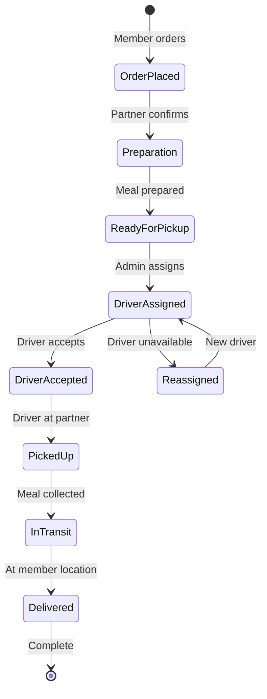
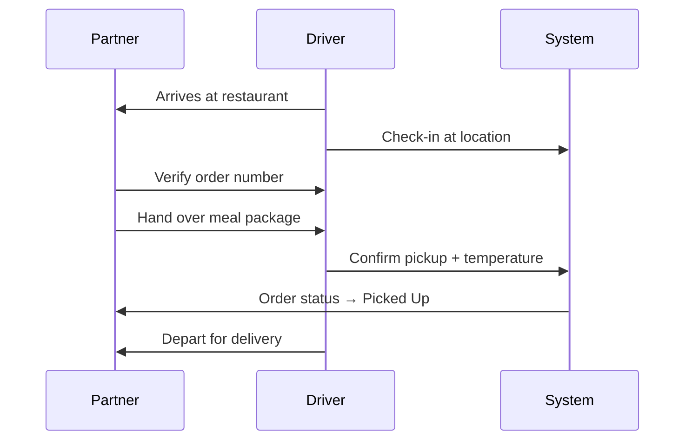
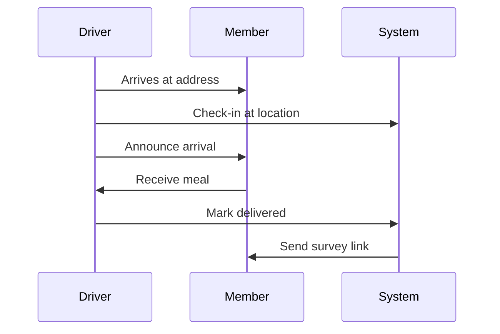
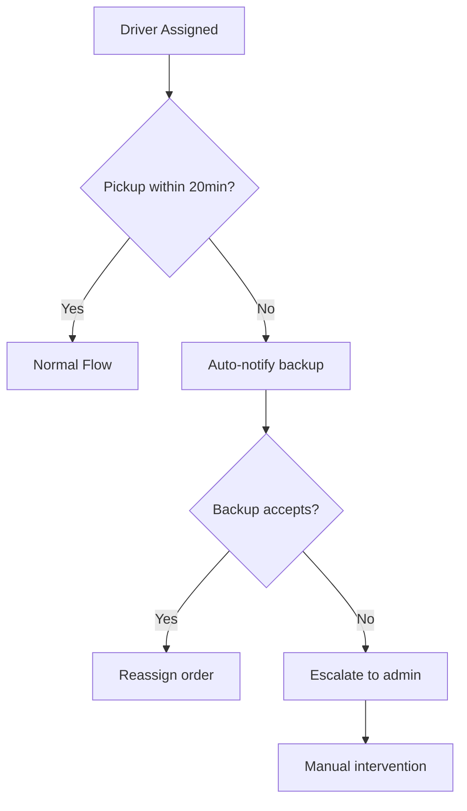
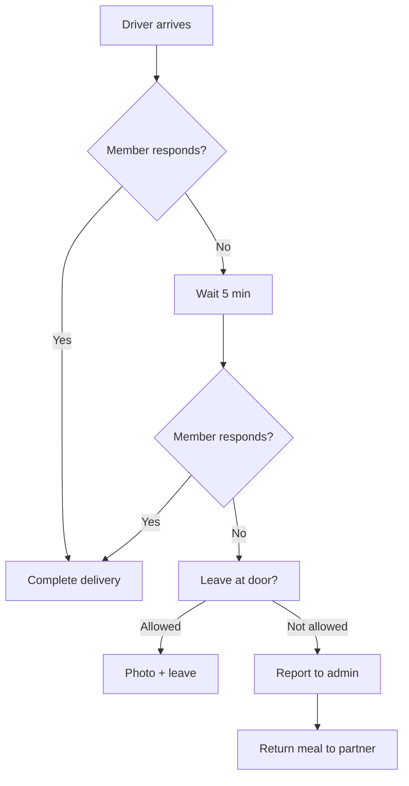
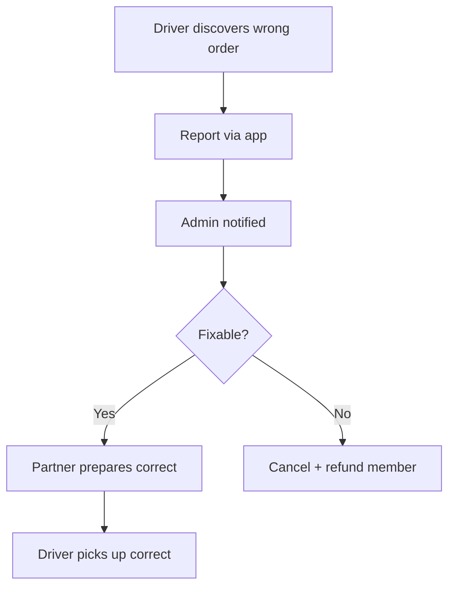

# Merry Meals - Delivery Flow Documentation

## Overview

Dokumen ini menjelaskan alur koordinasi antara Partner (restoran) dan Driver (volunteer) dalam proses pengiriman makanan ke Member.

---

## Delivery Flow Diagram



---

## Stakeholder Responsibilities

### Partner Responsibilities

| Phase          | Action                  | System Update              |
| -------------- | ----------------------- | -------------------------- |
| Order Received | Review order details    | Status: `pending`          |
| Accept Order   | Confirm can fulfill     | Status: `preparation`      |
| Prepare Meal   | Cook according to specs | -                          |
| Package        | Use proper containers   | -                          |
| Ready          | Await driver pickup     | Status: `ready_for_pickup` |
| Handoff        | Give meal to driver     | Driver signs/confirms      |

### Driver Responsibilities

| Phase     | Action                  | System Update        |
| --------- | ----------------------- | -------------------- |
| Available | Toggle status to online | `isAvailable: true`  |
| Assigned  | Receive notification    | Status: `assigned`   |
| Navigate  | Go to partner location  | GPS tracking         |
| Pickup    | Collect meal + verify   | Status: `picked_up`  |
| Transit   | Deliver to member       | Status: `in_transit` |
| Deliver   | Hand to member          | Status: `delivered`  |
| Complete  | Confirm in app          | Trigger survey       |

---

## Handoff Protocol

### Partner → Driver Handoff



**Checklist:**

- [ ] Verify order ID matches
- [ ] Check meal packaging is sealed
- [ ] Record temperature if applicable
- [ ] Confirm all items included
- [ ] Get partner sign-off (optional)

### Driver → Member Handoff



**Checklist:**

- [ ] Verify correct address/unit
- [ ] Follow delivery instructions
- [ ] Photo proof if leave-at-door
- [ ] Confirm member received
- [ ] Report any issues

---

## Status Flow Implementation

### Order Status Transitions

```php
// Order status constants
const STATUS_PENDING = 'pending';
const STATUS_PREPARATION = 'preparation';
const STATUS_READY = 'ready_for_pickup';
const STATUS_ASSIGNED = 'assigned';
const STATUS_PICKED_UP = 'picked_up';
const STATUS_IN_TRANSIT = 'in_transit';
const STATUS_DELIVERED = 'delivered';
const STATUS_CANCELLED = 'cancelled';

// Valid transitions
$validTransitions = [
    'pending' => ['preparation', 'cancelled'],
    'preparation' => ['ready_for_pickup', 'cancelled'],
    'ready_for_pickup' => ['assigned'],
    'assigned' => ['picked_up', 'assigned'], // reassign
    'picked_up' => ['in_transit'],
    'in_transit' => ['delivered'],
    'delivered' => [], // final state
    'cancelled' => [], // final state
];
```

---

## Communication Flow

### Notifications

| Event             | Notify  | Channel            |
| ----------------- | ------- | ------------------ |
| New Order         | Partner | Email + Dashboard  |
| Order Ready       | Admin   | Dashboard          |
| Driver Assigned   | Driver  | Push + Dashboard   |
| Pickup Complete   | Member  | SMS/Email          |
| Delivery Complete | Member  | Push + Survey Link |
| Issue Reported    | Admin   | Dashboard Alert    |

---

## Time Expectations

| Phase               | Expected Duration | Alert Threshold |
| ------------------- | ----------------- | --------------- |
| Order → Preparation | 5 min             | 15 min          |
| Preparation         | 20-30 min         | 45 min          |
| Ready → Assigned    | 5 min             | 10 min          |
| Assigned → Pickup   | 15 min            | 25 min          |
| Pickup → Delivery   | 20-30 min         | 45 min          |
| **Total**           | **~60-80 min**    | **>90 min**     |

---

## Edge Cases & Handling

### Case 1: Driver No-Show



### Case 2: Member Unavailable



### Case 3: Wrong Order



---

## Quality Checkpoints

### Partner Kitchen

- [ ] Meal matches order specifications
- [ ] Temperature appropriate (hot/cold)
- [ ] Portion size correct
- [ ] Packaging sealed properly
- [ ] Special dietary needs met

### Driver Pickup

- [ ] Order ID verified
- [ ] Package condition checked
- [ ] Temperature recorded
- [ ] All items present
- [ ] Thermal bag used if needed

### Driver Delivery

- [ ] Correct address confirmed
- [ ] Delivery time within limit
- [ ] Member identity verified
- [ ] Package condition maintained
- [ ] Special instructions followed
