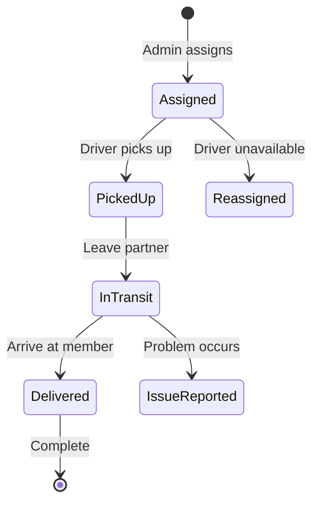

# Role: Driver (Volunteer)

## Overview

Driver adalah volunteer yang mengambil makanan dari partner restoran dan mengantarkan ke member. Role ini krusial untuk operasional Meals on Wheels.

---

## Permissions Matrix

| Permission             | Driver | Notes                     |
| ---------------------- | :----: | ------------------------- |
| View Own Profile       |   ✅   | Edit allowed              |
| View Assigned Orders   |   ✅   | Own assignments           |
| Update Delivery Status |   ✅   | Own deliveries            |
| Toggle Availability    |   ✅   | Online/offline            |
| View Delivery History  |   ✅   | Own history               |
| View Member Details    |   ✅   | Limited (address only)    |
| View Partner Details   |   ✅   | Limited (pickup location) |

---

## Features

### 1. Order Dashboard

- View assigned deliveries
- Order priority indicators
- Pickup and delivery locations
- Member special instructions

### 2. Order Tracking

- Real-time status updates
- Progress timeline
- ETA calculation (proposed)
- Route optimization (proposed)

### 3. Availability Toggle

- Set online/offline status
- Schedule availability (proposed)
- Break time option

### 4. Delivery Actions

- Mark as picked up
- Mark as in transit
- Mark as delivered
- Photo proof option
- Report issue button

### 5. Delivery History

- Past deliveries log
- Performance metrics
- Member ratings (proposed)
- Earnings summary (if applicable)

---

## Proposed New Features

### Navigation Integration

```
- Google Maps integration
- Optimal route suggestions
- Traffic-aware ETA
- Turn-by-turn directions link
```

### Performance Dashboard

```
- Deliveries completed
- On-time rate
- Member ratings
- Distance covered
- Active time tracking
```

### Communication Tools

```
- In-app messaging (proposed)
- Member contact (masked number)
- Partner contact for pickup
- Admin support chat
```

---

## Dashboard Components

| Component           | Description           |
| ------------------- | --------------------- |
| Availability Toggle | Online/offline switch |
| Active Deliveries   | Current assignments   |
| Stats Summary       | Today's metrics       |
| Recent Deliveries   | Last 5 completed      |
| Notifications       | New assignments       |

---

## Routes

```php
// Current
Route::middleware('roles:driver')->prefix('driver')->group(function () {
    Route::get('/dashboard', [RiderController::class, 'index'])->name('driver.dashboard');
    Route::post('/availability', [RiderController::class, 'toggleAvailability'])->name('driver.availability.toggle');
    Route::patch('/delivery/{id}/status', [RiderController::class, 'updateDeliveryStatus'])->name('driver.delivery.status');
});

// Proposed additions
Route::middleware('roles:driver')->prefix('driver')->group(function () {
    // Delivery Details
    Route::get('/delivery/{id}', [RiderController::class, 'showDelivery'])->name('driver.delivery.show');

    // History
    Route::get('/history', [RiderController::class, 'history'])->name('driver.history');

    // Issue Reporting
    Route::post('/delivery/{id}/issue', [RiderController::class, 'reportIssue'])->name('driver.delivery.issue');

    // Photo Proof
    Route::post('/delivery/{id}/proof', [RiderController::class, 'uploadProof'])->name('driver.delivery.proof');

    // Metrics
    Route::get('/metrics', [RiderController::class, 'metrics'])->name('driver.metrics');
});
```

---

## Order Status Flow (Driver Perspective)



---

## Verification & Safety

### Driver Requirements

- Valid ID verification
- Background check (if applicable)
- Training completion
- App familiarity test

### Safety Features

- GPS tracking during delivery
- Emergency contact button
- Issue reporting system
- Check-in checkpoints
