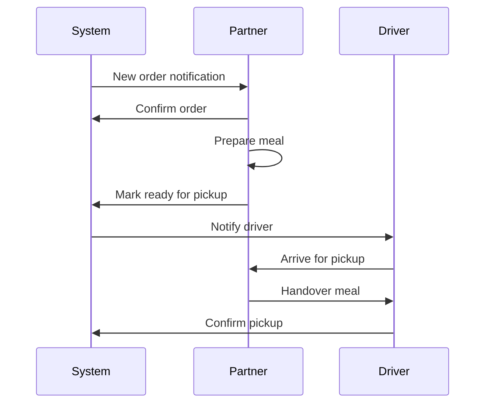

# Role: Partner (Restaurant)

## Overview

Partner adalah restoran atau dapur yang menyediakan makanan bernutrisi untuk program Merry Meals. Mereka bertanggung jawab atas kualitas dan ketersediaan makanan.

---

## Permissions Matrix

| Permission               | Partner | Notes             |
| ------------------------ | :-----: | ----------------- |
| View Own Profile         |   ✅    | Edit allowed      |
| Manage Own Meals         |   ✅    | Full CRUD         |
| View Own Orders          |   ✅    | From members      |
| Update Order Status      |   ✅    | Preparation stage |
| Toggle Meal Availability |   ✅    | Per meal          |
| Set Kitchen Status       |   ✅    | Open/closed       |
| View Own Reports         |   ✅    | Sales/orders      |

---

## Features

### 1. Meal Management

- Create new meals
- Edit meal details
- Delete meals
- Toggle availability per meal
- Upload meal images
- Ingredient management

### 2. Availability Control

- Per-meal availability toggle
- Daily limit setting (proposed)
- Temporary unavailable option
- Schedule availability (proposed)

### 3. Order Management

- View incoming orders
- Confirm order receipt
- Update preparation status
- Mark ready for pickup

### 4. Recipe Management

- Detailed ingredient list
- Nutritional information (proposed)
- Allergen declarations
- Prep instructions (internal)

### 5. Kitchen Status

- Open/closed indicator
- Operating hours (proposed)
- Capacity indicator (proposed)

---

## Proposed New Features

### Menu Planning

```
- Weekly menu scheduler
- Rotating specials
- Seasonal offerings
- Dietary category tags
```

### Nutritional Dashboard

```
- Auto-calculate nutrition
- Ingredient database
- Dietary compliance checker
- Allergen matrix
```

### Performance Analytics

```
- Order volume trends
- Popular meals
- Feedback summary
- Prep time metrics
```

### Inventory Integration (Future)

```
- Ingredient stock tracking
- Low stock alerts
- Auto-disable when out
- Reorder reminders
```

---

## Dashboard Components

| Component         | Description           |
| ----------------- | --------------------- |
| Kitchen Status    | Open/closed toggle    |
| Today's Orders    | Incoming orders       |
| Preparation Queue | Orders in progress    |
| Meal Inventory    | Availability overview |
| Performance Stats | Weekly metrics        |

---

## Routes

```php
// Current
Route::middleware('roles:partner')->prefix('partner')->group(function () {
    Route::get('/', [PartnerDashboardController::class, 'index'])->name('partner.index');
    Route::get('/orders', [PartnerOrderController::class, 'index'])->name('partner.orders.index');
    Route::post('/orders/status/{id}', [PartnerOrderController::class, 'update'])->name('partner.orders.update');

    // Partner Profile
    Route::get('/partner-profile/create', [PartnerProfileController::class, 'create'])->name('partner.create');
    Route::post('/partner-profile/store', [PartnerProfileController::class, 'store'])->name('partner.store');
    Route::get('/partner-profile', [PartnerProfileController::class, 'edit'])->name('partner.profile.edit');
    Route::put('/partner-profile', [PartnerProfileController::class, 'update'])->name('partner.profile.update');
});

// Meal routes (accessible by partner)
Route::name('meal.')->group(function () {
    Route::get('/meals', [PartnerMealController::class, 'index'])->name('index');
    Route::get('/meals/create', [PartnerMealController::class, 'create'])->name('create');
    Route::post('/meals/store', [PartnerMealController::class, 'store'])->name('store');
    Route::get('/meals/edit/{id}', [PartnerMealController::class, 'edit'])->name('edit');
    Route::put('/meals/update/{id}', [PartnerMealController::class, 'update'])->name('update');
    Route::delete('/meals/destroy/{id}', [PartnerMealController::class, 'destroy'])->name('destroy');
});

// Proposed additions
Route::middleware('roles:partner')->prefix('partner')->group(function () {
    // Meal availability toggle
    Route::patch('/meals/{id}/availability', [PartnerMealController::class, 'toggleAvailability'])
        ->name('partner.meals.availability');

    // Kitchen status
    Route::post('/kitchen/status', [PartnerDashboardController::class, 'toggleKitchen'])
        ->name('partner.kitchen.toggle');

    // Analytics
    Route::get('/analytics', [PartnerAnalyticsController::class, 'index'])
        ->name('partner.analytics');

    // Menu planning
    Route::get('/menu/schedule', [MenuScheduleController::class, 'index'])
        ->name('partner.menu.schedule');
});
```

---

## Order Flow (Partner Perspective)



---

## Quality Standards

### Food Safety

- [ ] Valid food license
- [ ] Hygiene certification
- [ ] Temperature control
- [ ] Proper packaging

### Meal Requirements

- [ ] Nutritional balance
- [ ] Clear ingredient listing
- [ ] Allergen declarations
- [ ] Portion consistency

### Service Standards

- [ ] Timely preparation
- [ ] Order accuracy
- [ ] Professional communication
- [ ] Issue resolution
